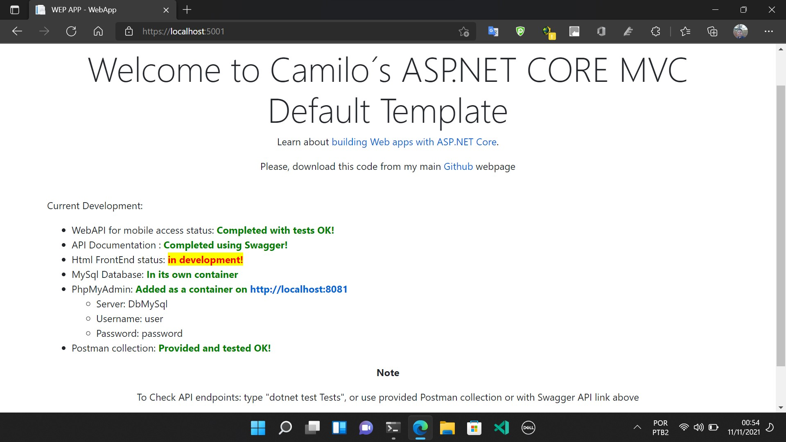

# MVC_CRUD

## Important Steps  

Step 1: Execute File 1st_EXECUTE_THIS.bat  
Step 2: Create Environment variable on windows called ServerStringConnection with value "server=localhost"  
Step 3: Execute file 2nd_UpdateMigrations.bat  

## About Repository

This is an App create to Manage employees from a ficticious Company where:  

Employees have the following properties:

- Name and Surname (required);
- E-mail (valid and required);
- employee number (unique and required);
- Phone (not required);
- Leader Name (optional, *A Leader is also an employee);
- Password (must be stored encrypted)
  
On this Template:

- API´s were developed using ASP.NET CORE and ASP.NET CORE MVC
- Domain Entities have CRUD 
- Database is MySQL (in container)
- Frontend will be MVC VIEWS ENDPOINTS (in progress)
- API is Documented using Swagger with Full Authentication : Bearer and Custom Access-Token
  Note(You will need an Id_Token before requesting an Access_Token)
  
Extra  

- You can find unit tests and integration tests in the Tests Folder
- POSTMAN collection is provided for testing purposes
- Patterns Used: Repository
- Authentication Mechanisms: JWT, Access-Token

